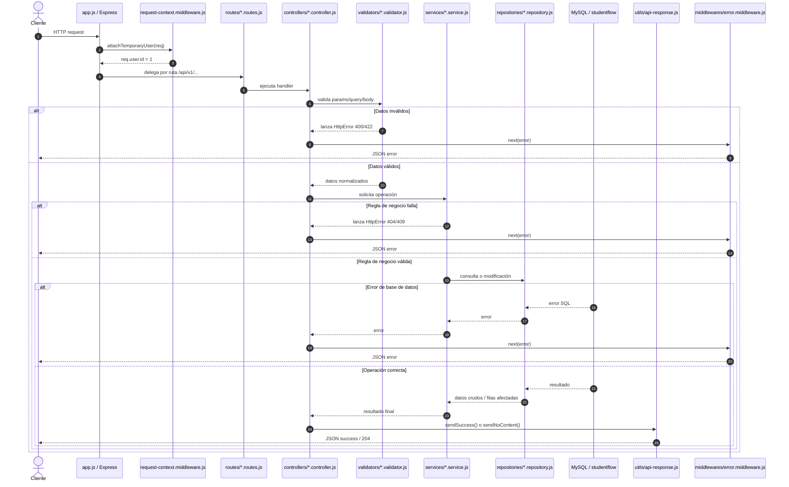

```mermaid
sequenceDiagram
    autonumber
    actor Cliente
    participant App as app.js / Express
    participant Ctx as request-context.middleware.js
    participant Router as routes/*.routes.js
    participant Controller as controllers/*.controller.js
    participant Validator as validators/*.validator.js
    participant Service as services/*.service.js
    participant Repo as repositories/*.repository.js
    participant DB as MySQL / studentflow
    participant Resp as utils/api-response.js
    participant Err as middlewares/error.middleware.js
    Cliente->>App: HTTP request
    App->>Ctx: attachTemporaryUser(req)
    Ctx-->>App: req.user.id = 1
    App->>Router: delega por ruta /api/v1/...
    Router->>Controller: ejecuta handler
    Controller->>Validator: valida params/query/body
    alt Datos inválidos
        Validator-->>Controller: lanza HttpError 400/422
        Controller->>Err: next(error)
        Err-->>Cliente: JSON error
    else Datos válidos
        Validator-->>Controller: datos normalizados
        Controller->>Service: solicita operación
        alt Regla de negocio falla
            Service-->>Controller: lanza HttpError 404/409
            Controller->>Err: next(error)
            Err-->>Cliente: JSON error
        else Regla de negocio válida
            Service->>Repo: consulta o modificación

            alt Error de base de datos
                DB-->>Repo: error SQL
                Repo-->>Service: error
                Service-->>Controller: error
                Controller->>Err: next(error)
                Err-->>Cliente: JSON error
            else Operación correcta
                DB-->>Repo: resultado
                Repo-->>Service: datos crudos / filas afectadas
                Service-->>Controller: resultado final
                Controller->>Resp: sendSuccess() o sendNoContent()
                Resp-->>Cliente: JSON success / 204
            end
        end
    end
```
