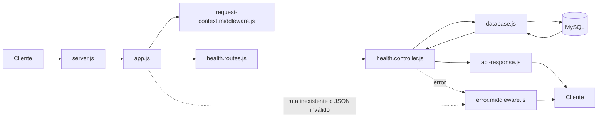

```mermaid
flowchart LR
    A[Cliente] --> B[server.js]
    B --> C[app.js]
    C --> D[request-context.middleware.js]
    C --> E[health.routes.js]
    E --> F[health.controller.js]
    F --> G[database.js]
    G --> H[(MySQL)]
    H --> G
    G --> F
    F --> I[api-response.js]
    I --> J[Cliente]
    F -. error .-> K[error.middleware.js]
    C -. ruta inexistente o JSON inválido .-> K
    K --> J
```
