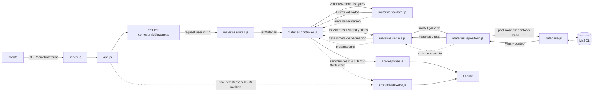

```mermaid
flowchart LR
    A[Cliente] -->|GET /api/v1/materias| B[server.js]
    B --> C[app.js]
    C --> D[request-context.middleware.js]
    D -->|request.user.id = 1| E[materias.routes.js]
    E -->|listMaterias| F[materias.controller.js]
    F -->|validateMateriaListQuery| G[materias.validator.js]
    G -->|Filtros validados| F
    F -->|listMaterias: usuario y filtros| H[materias.service.js]
    H -->|findAllByUserId| I[materias.repositorio.js]
    I -->|pool.execute: conteo y listado| J[database.js]
    J --> K[(MySQL)]
    K --> J
    J -->|Filas y conteo| I
    I -->|materias y total| H
    H -->|data y meta de paginación| F
    F -->|sendSuccess: HTTP 200| L[api-response.js]
    L --> M[Cliente]
    G -. error de validación .-> F
    I -. error de consulta .-> H
    H -. propaga error .-> F
    F -. next: error .-> N[error.middleware.js]
    C -. ruta inexistente o JSON inválido .-> N
    N --> M
```
